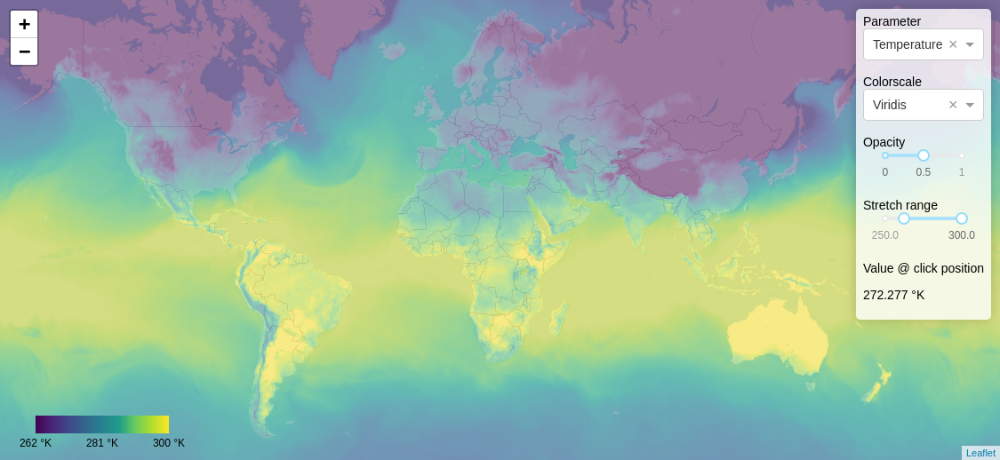

This repository holds a small example of a Python stack that enables visualization of geospatial raster data. It consists of three main elements,

1) A few scripts that convert wgrib2 files / numpy arrays into [cloud optimized geotiff](https://www.cogeo.org/) (COG)
2) A script that launches a [Terracotta](https://github.com/DHI-GRAS/terracotta) tile server to serve the geotiff files
3) A demo application written in [Dash](https://plotly.com/dash/) that visualizes the data using the [dash-leaflet](https://github.com/thedirtyfew/dash-leaflet) library

Special care has been taken to ensure WYSIWYG pixel drilling, i.e. a 1:1 correspondence between the values shown on the map and the sampled valued. 

#### Running the demo 

Clone the repo, and enter the folder,

    git clone git@github.com:thedirtyfew/terracotta-dash-example.git && cd terracotta-dash-example

Create a virtual environment and install Python requirements,

    python3 -m venv venv && source venv/bin/activate && pip install -r requirements.txt

Next, we need some data. In this example, we'll use weather data from [GFS](https://www.ncdc.noaa.gov/data-access/model-data/model-datasets/global-forcast-system-gfs) (downloaded and parsed using the `gfs_to_npz.py` script) , but any geospatial raster data would do. Before the data can be loaded by the tile server, it must be converted into COG,

    python3 npz_to_tiff.py
    
The tiles are served to the map component via a tile server. In this example, [Terracotta](https://github.com/DHI-GRAS/terracotta) is used. To start it, run

    python3 tc_server.py

With the tile server running, start the demo application in a different terminal,

    python3 app.py

If you open a browser and go to `http://localhost:8050`, you should see a map like this

#### Can I visualize my own data? 

It is straight forward to visualize other geospatial raster data, you just need to setup a pipeline to convert them into COG. The `npz_to_tiff.py` script, which takes simple numpy arrays as input, should be a good starting point.

#### What about production?

Both [Terracotta](https://github.com/DHI-GRAS/terracotta) and [Dash](https://plotly.com/dash/) are based on [Flask](https://flask.palletsprojects.com/en/1.1.x/). In production, a proper web server (such a [gunicorn](https://gunicorn.org/)) should be used.

#### How did you achieve WYSIWYG pixel drilling?

To ensure a 1:1 correspondence between the values shown on the map, and the sampled valued, 

* The data must be interpolated onto a grid that is regular in the projection in which the data is viewed. Most web maps, including this example, use `epsg:3857`. This task is performed by the `interpolate_onto_grid` function

* The pixels of the data grid must be aligned with map tiles. This is ensured by passing `web_optimized=True` to the `cog_translate` function

* The tile server cannot perform any post processing (e.g. interpolation) of the data. With Terracotta, this is achieved via the settings `REPROJECTION_METHOD="nearest"`
